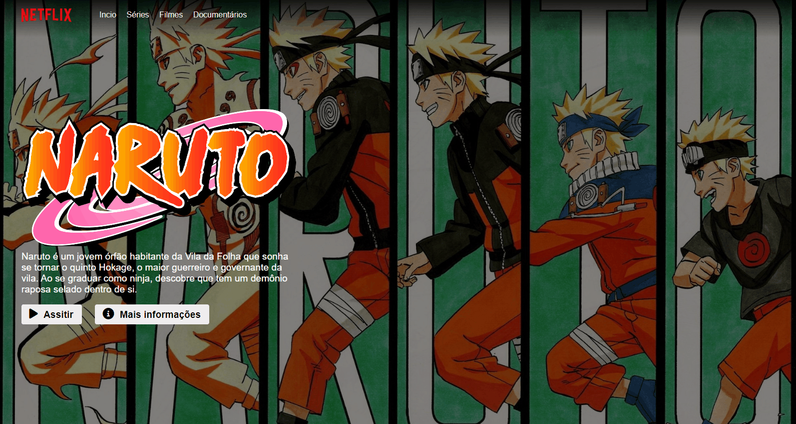
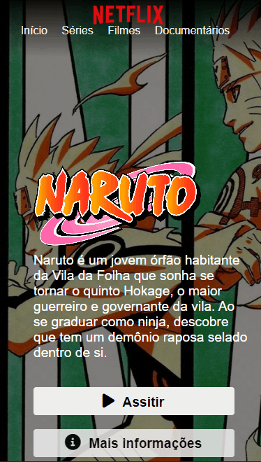

<h1 align=center>Netflix Clone</h1>
<h2>Sobre o projeto</h2>

Dentro do deste projeto, tive como exercício recriar a página inicial do serviço de streaming Netflix, dando um toque de personalidade e criatividade, coloquei minhas obras ficcionais favoritas. Para sua construção utilizei ferramentas e bibliotecas como Jquery e OwlCarrocel, fazendo a responsividade dos carrosséis presentes no site, funcionando tanto em smartphones, quanto desktop.

<h2>Link do projeto:<a href="https://eduardoagusto.github.io/myNetflixWebsiteClone/"> https://eduardoagusto.github.io/myNetflixWebsiteClone/</a></h2>

<h2>Imagens do Projeto</h2>
<h3>*Menu Desktop</h3>

 
<h3>*Lista Desktop</h3>

 
<h3 align=center>*Smartphone</h3>

 
<h2>Design</h2>

Em realação ao design deste projeto, tentei recriar fielmente a interface atual do streaming Netflix, desde a logo, o menu, fonte e descrições. Algumas mudanças no catálogo foram feitas, colocando no lugar obras de meu gosto pessoal.

<h2>Tecnologias utilizadas</h2>

- JavaScript

- Jquery

- OwlCarousel

- HTML5

- CSS3
